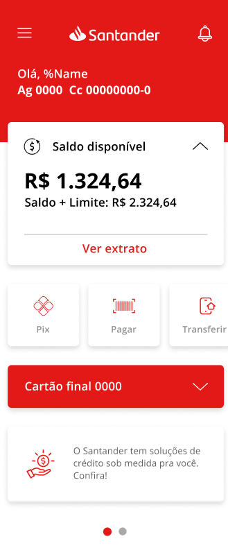
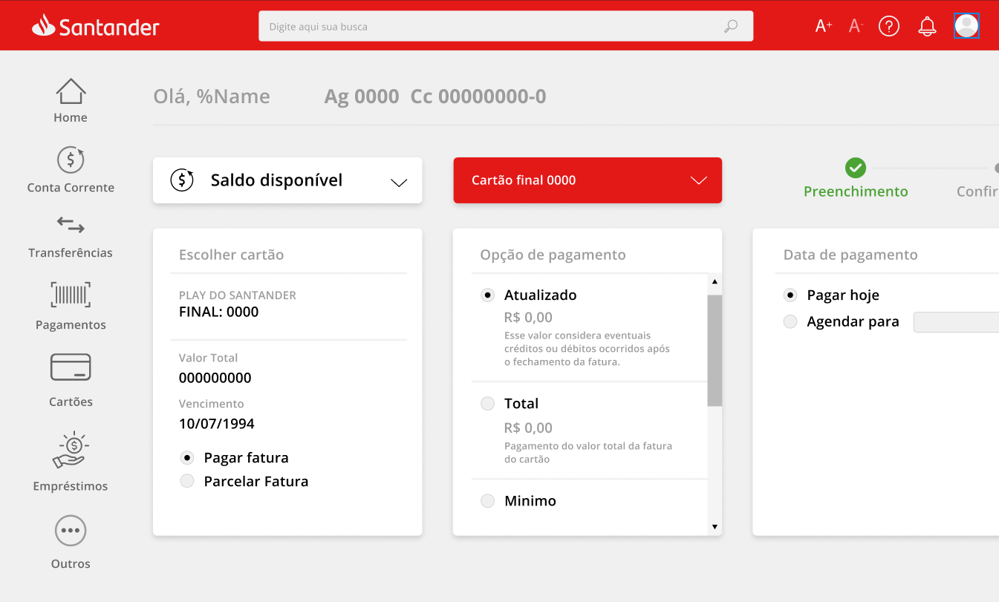
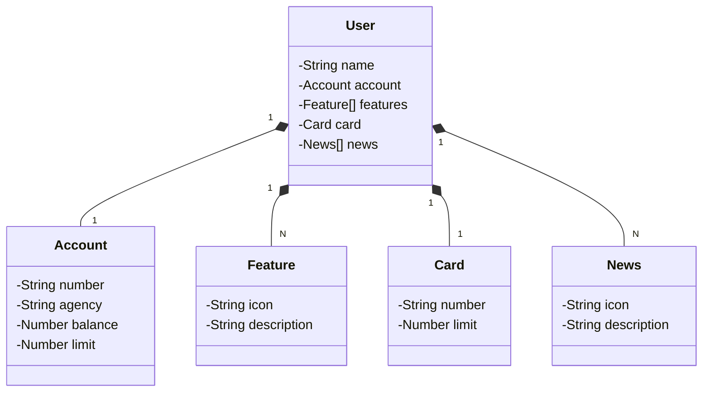

# Santander Dev Week
Java RESTful API desenvolvida para a Santander Dev Week, implementada na nuvem utilizando Spring Boot 3 e Java 17, com aproveitamento das facilidades proporcionadas pelo Railway para deploy e monitoramento.
**Principais Tecnologias:**

## Figma
Representação visual do domínio da API, facilitando a análise e solução de forma mais clara e compreensível do projeto. Isso permite uma melhor visualização do funcionamento da API e ajuda na tomada de decisões durante o desenvolvimento.

## Principais Tecnologias:
- **Java 17:** Utilizaremos a versão LTS mais recente do Java para tirar vantagem das últimas inovações que essa linguagem robusta e amplamente utilizada oferece.

- **Spring Boot 3:** Versão do Spring Boot, que maximiza a produtividade do desenvolvedor por meio de sua poderosa premissa de autoconfiguração.

- **Spring Data JPA:** Simplificar camada de acesso aos dados, facilitando a integração com bancos de dados SQL.

- **OpenAPI (Swagger):** Documentação de API eficaz e fácil de entender usando a OpenAPI (Swagger), perfeitamente alinhada com a alta produtividade que o Spring Boot oferece.

- **Railway:** Deploy e monitoramento de soluções na nuvem, além de oferecer diversos bancos de dados como serviço e pipelines de CI/CD.

## Diagrama de Classes
